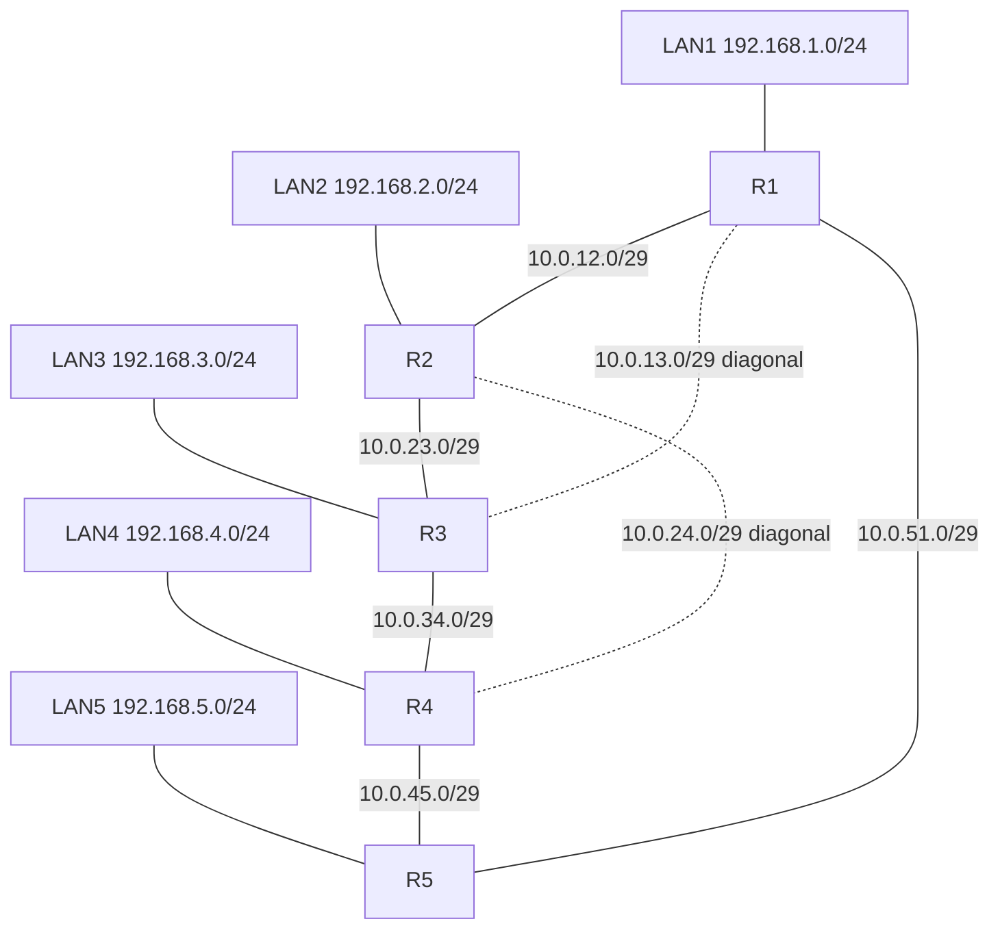

# Topologia — 5 roteadores

## Topologia física

Anel R1-R2-R3-R4-R5-R1 com duas diagonais (R1-R3 e R2-R4). Cada roteador
tem uma LAN de acesso (stub).

Enlaces: anel R1-R2-R3-R4-R5-R1 (linhas cheias) e diagonais R1-R3 e R2-R4
(tracejadas).

Essa malha garante pelo menos dois caminhos disjuntos entre qualquer par
de roteadores, e permite observar a reconvergência quando um enlace cai.
O cenário de falha usado nos testes derruba **R1-R5**, que é o caminho
direto LAN1 → LAN5. Depois da falha, o tráfego deve seguir R1 → R2/R3 → R4 → R5.

## Topologia lógica (endereçamento)

Os enlaces usam /29 e as LANs /24. O Docker reserva um endereço de cada
rede para o gateway da bridge do host, fixado no último útil (.6 nos
enlaces, .254 nas LANs). Esse gateway **não** participa do roteamento.

| Enlace | Sub-rede      | Ponta A        | Ponta B        |
|--------|---------------|----------------|----------------|
| R1-R2  | 10.0.12.0/29  | R1: 10.0.12.1  | R2: 10.0.12.2  |
| R2-R3  | 10.0.23.0/29  | R2: 10.0.23.1  | R3: 10.0.23.2  |
| R3-R4  | 10.0.34.0/29  | R3: 10.0.34.1  | R4: 10.0.34.2  |
| R4-R5  | 10.0.45.0/29  | R4: 10.0.45.1  | R5: 10.0.45.2  |
| R5-R1  | 10.0.51.0/29  | R5: 10.0.51.1  | R1: 10.0.51.2  |
| R1-R3  | 10.0.13.0/29  | R1: 10.0.13.1  | R3: 10.0.13.2  |
| R2-R4  | 10.0.24.0/29  | R2: 10.0.24.1  | R4: 10.0.24.2  |

| Roteador | LAN            | IP do roteador | Loopback (router-id) | Host de teste |
|----------|----------------|----------------|----------------------|---------------|
| R1       | 192.168.1.0/24 | 192.168.1.1    | 10.255.0.1/32        | client1 .10   |
| R2       | 192.168.2.0/24 | 192.168.2.1    | 10.255.0.2/32        | —             |
| R3       | 192.168.3.0/24 | 192.168.3.1    | 10.255.0.3/32        | —             |
| R4       | 192.168.4.0/24 | 192.168.4.1    | 10.255.0.4/32        | —             |
| R5       | 192.168.5.0/24 | 192.168.5.1    | 10.255.0.5/32        | client5 .10   |

Nomes de interface: o Docker **não garante** a ordem `eth0..ethN`. Por
isso as configurações do FRR usam apenas `network <prefixo>`, sem nome de
interface, e os scripts localizam a interface pelo IP. Para ver o
mapeamento real: `docker exec r1 ip -br addr`.
